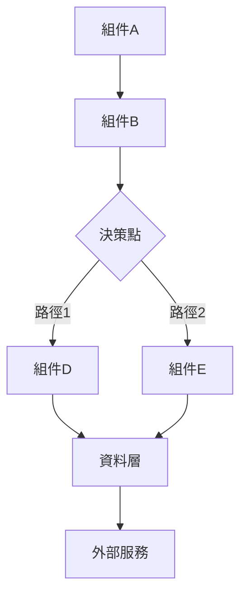
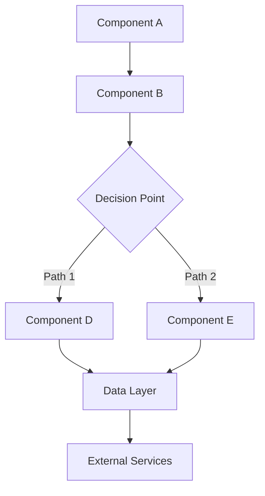

# Spec Driven Development - 架構設計階段

您已經啟動了 Spec Driven Development 的架構設計流程。

## 前置檢查與環境分析

### 1. 文件依賴檢查
- 確認 `.claude/sdd/requirements.md` 文件存在
- 檢查專案根目錄結構
- 分析現有技術環境和依賴

### 2. 需求規格解析
- 深度分析所有 User Stories
- 識別功能性與非功能性需求
- 理解業務約束和技術限制

## 全面架構設計流程

### 階段 1：系統分析與技術評估
- **需求解構**：將複雜需求分解為可實作的技術組件
- **技術環境評估**：分析現有技術棧、框架和工具鏈
- **可行性分析**：評估技術實現的複雜度和風險
- **資源限制評估**：考慮時間、人力、預算等約束條件
- **依賴關係mapping**：識別系統內外部依賴

### 階段 2：整體架構設計
- **系統邊界定義**：明確系統範圍和對外介面
- **架構模式選擇**：選擇適合的架構模式（MVC、微服務、事件驅動等）
- **分層架構設計**：定義表現層、業務層、資料層的職責
- **服務拆分策略**：基於業務邊界進行服務劃分
- **資料架構規劃**：設計資料模型、儲存策略、資料流

### 階段 3：技術選型與介面設計
- **核心技術選型**：框架、程式語言、資料庫選擇
- **介面標準制定**：API 設計、資料格式、通訊協定
- **組件介面定義**：模組間的介面契約和相依注入
- **整合方案設計**：第三方服務整合和資料同步策略

### 階段 4：非功能性需求設計
- **錯誤處理架構**：
  - 統一異常處理機制
  - 錯誤分類和回應策略
  - 日誌記錄和監控方案
- **效能最佳化設計**：
  - 快取策略和層級
  - 資料庫最佳化方案
  - 非同步處理架構
- **安全性架構**：
  - 身份驗證和授權機制
  - 資料加密和傳輸安全
  - 攻擊防護和安全監控
- **可擴展性設計**：
  - 水平與垂直擴展策略
  - 負載均衡和容錯機制
  - 微服務拆分和治理

### 階段 5：測試策略與品質保證
- **測試架構設計**：
  - 單元測試策略和工具選擇
  - 整合測試環境和自動化
  - 端到端測試場景設計
  - 效能測試基準和方法
- **持續整合設計**：
  - CI/CD 流程規劃
  - 代碼品質閘門
  - 自動化部署策略
- **監控與觀測**：
  - 系統監控指標定義
  - 業務監控和告警
  - 日誌收集和分析

### 階段 6：風險評估與應對策略
- **技術風險識別**：
  - 技術債務和遺留系統風險
  - 新技術採用風險
  - 效能和擴展性風險
- **業務風險評估**：
  - 需求變更風險
  - 時程壓力風險
  - 資源不足風險
- **風險緩解方案**：
  - 技術降級方案
  - 分階段交付策略
  - 應急預案設計

## 輸出結構

最終將產生詳細的 `design.md` 文件，包含：

### 1. 概述與架構圖
- 系統整體架構圖（Mermaid 格式）
- 分層架構和組件關係
- 資料流和控制流圖表

### 2. 組件與介面規格
- 核心組件詳細設計
- 介面定義和契約
- 資料模型和 API 規格

### 3. 技術實作規格
- 技術選型理由和對比
- 開發環境和工具鏈
- 部署和維運策略

### 4. 品質保證方案
- 完整的測試策略
- 代碼品質標準
- 效能和安全性要求

## 設計參數

$ARGUMENTS

---

## 架構設計執行

我將基於需求文件進行全面的系統架構設計，從技術可行性到實作細節，確保設計方案的完整性和可執行性。

開始架構設計分析...

---

## Design Document 格式模板

### 文件標題格式
```markdown
# 設計文件
# Design Document
```

### 文件結構模板

```markdown
# 設計文件

## 概述

[系統整體描述，包含架構理念、設計原則和核心特色]

## 架構

### 整體架構圖



### 分層架構

1. **表現層 (Presentation Layer)**
   - [責任描述]
   - [主要組件]

2. **業務邏輯層 (Business Logic Layer)**
   - [責任描述]
   - [主要組件]

3. **服務層 (Service Layer)**
   - [責任描述]
   - [主要組件]

4. **資料層 (Data Layer)**
   - [責任描述]
   - [主要組件]

## 組件與介面

### 核心組件

#### 1. [組件名稱] ([English Name])
```typescript
interface ComponentInterface {
  method1(param: Type): ReturnType;
  method2(param: Type): ReturnType;
}

interface DataModel {
  field1: Type;
  field2: Type;
  field3: Type;
}
```

#### 2. [組件名稱] ([English Name])
```typescript
interface AnotherInterface {
  process(input: InputType): OutputType;
  validate(data: DataType): ValidationResult;
}
```

### 支援組件

#### [支援組件名稱] ([Support Component])
```typescript
interface SupportInterface {
  supportMethod(param: Type): Result;
}
```

## 資料模型

### 核心資料結構

```typescript
interface CoreDataStructure {
  id: string;
  name: string;
  status: StatusType;
  metadata: MetadataType;
  createdAt: Date;
  updatedAt: Date;
}

interface RelatedStructure {
  reference: string;
  relationship: RelationType;
  properties: PropertyMap;
}
```

## 錯誤處理

### 錯誤分類與處理策略

#### 1. 輸入驗證錯誤
- **錯誤類型**：[具體錯誤類型]
- **處理策略**：[處理方法]
- **恢復機制**：[恢復方案]

#### 2. 業務邏輯錯誤
- **錯誤類型**：[具體錯誤類型]
- **處理策略**：[處理方法]
- **恢復機制**：[恢復方案]

### 錯誤處理架構

```typescript
interface ErrorHandler {
  handleError(error: SystemError): ErrorResponse;
  logError(error: SystemError): void;
  suggestRecovery(error: SystemError): RecoveryOption[];
}

interface SystemError {
  type: ErrorType;
  severity: ErrorSeverity;
  message: string;
  context: ErrorContext;
  timestamp: Date;
}
```

## 測試策略

### 測試層級

#### 1. BDD 行為測試
- **範圍**：[使用者行為和業務場景驗證]
- **工具**：[Cucumber, SpecFlow, Behave 等]
- **重點**：[Gherkin 場景執行、業務規則驗證]
- **層級**：最高層級，驗證業務需求

#### 2. 整合測試
- **範圍**：[組件間互動和 API 介面]
- **工具**：[Jest, TestNG, pytest 等]
- **重點**：[模組整合、資料流驗證]
- **層級**：中間層級，驗證系統協作

#### 3. 單元測試
- **範圍**：[個別函數和類別方法]
- **工具**：[JUnit, pytest, Jest 等]
- **覆蓋率目標**：[90%+]
- **重點**：[邊界條件、錯誤處理、資料驗證]
- **層級**：最低層級，驗證程式邏輯

### BDD 測試架構設計

#### BDD 測試金字塔

```
    ┌─────────────────┐
    │   BDD Tests     │ ← Gherkin 場景測試 (少量、高價值)
    │  (Behavior)     │
    └─────────────────┘
          ┌─────────────────────┐
          │ Integration Tests   │ ← API/服務整合測試 (中等數量)
          │   (Contract)        │
          └─────────────────────┘
                ┌─────────────────────────┐
                │    Unit Tests          │ ← 函數/方法測試 (大量、快速)
                │    (Logic)             │
                └─────────────────────────┘
```

#### BDD 測試分層策略

1. **Feature 層級測試**
   - 端到端使用者場景
   - 跨系統邊界驗證
   - 真實環境執行

2. **Scenario 層級測試**
   - 特定業務流程
   - 模擬外部依賴
   - 控制環境變數

3. **Step 層級測試**
   - 個別步驟驗證
   - 單元測試支撐
   - 快速回饋循環

### 測試自動化策略

```typescript
interface BDDTestStrategy {
  // BDD 層級
  featureTests: FeatureTestSuite[];
  scenarioTests: ScenarioTestSuite[];
  stepDefinitions: StepDefinition[];

  // 傳統測試層級
  integrationTests: IntegrationTestSuite[];
  unitTests: UnitTestSuite[];

  // 支援工具
  testData: TestDataManager;
  mocks: MockService[];
  environments: TestEnvironment[];
}

interface FeatureTestSuite {
  feature: string;
  scenarios: Scenario[];
  background?: Background;
  testEnvironment: string;
  executionMode: 'parallel' | 'sequential';
}

interface Scenario {
  name: string;
  steps: Step[];
  tags: string[];
  dataTable?: DataTable;
  examples?: Examples;
}

interface Step {
  type: 'Given' | 'When' | 'Then' | 'And' | 'But';
  text: string;
  parameters?: any[];
  implementation: StepImplementation;
}
```

### BDD 工具和框架選擇

#### 主流 BDD 框架對比

| 語言/平台 | 推薦框架 | 特色 | 適用場景 |
|-----------|----------|------|----------|
| JavaScript/Node.js | Cucumber.js | 原生支援、豐富生態 | Web 應用、API 測試 |
| Java | Cucumber-JVM | 企業級、Spring 整合 | 企業應用、微服務 |
| Python | Behave | 簡潔語法、pytest 整合 | 資料科學、自動化 |
| C# | SpecFlow | Visual Studio 整合 | .NET 生態系統 |
| Ruby | Cucumber | 原創框架、成熟穩定 | Ruby on Rails |

#### 工具整合架構

```typescript
interface BDDToolchain {
  // 核心 BDD 工具
  bddFramework: 'Cucumber' | 'SpecFlow' | 'Behave';

  // 測試執行環境
  testRunner: TestRunner;

  // 報告和可視化
  reportGenerator: ReportGenerator;

  // 持續整合
  ciIntegration: CIConfiguration;

  // 測試資料管理
  dataManagement: TestDataStrategy;
}
```

## 安全性考量

### 資料安全
- [安全措施1]
- [安全措施2]
- [安全措施3]

### 執行安全
- [安全措施1]
- [安全措施2]
- [安全措施3]

## 效能最佳化

### 快取策略
- [快取策略1]
- [快取策略2]
- [快取策略3]

### 並行處理
- [並行策略1]
- [並行策略2]
- [並行策略3]

## 可擴展性設計

### 模組化架構
- [模組化方案1]
- [模組化方案2]

### 配置管理
- [配置管理方案1]
- [配置管理方案2]
```

### 英文格式模板

```markdown
# Design Document

## Overview

[Overall system description, including architectural philosophy, design principles, and core features]

## Architecture

### Overall Architecture Diagram



### Layered Architecture

1. **Presentation Layer**
   - [Responsibility description]
   - [Main components]

2. **Business Logic Layer**
   - [Responsibility description]
   - [Main components]

3. **Service Layer**
   - [Responsibility description]
   - [Main components]

4. **Data Layer**
   - [Responsibility description]
   - [Main components]

## Components and Interfaces

### Core Components

#### 1. [Component Name]
```typescript
interface ComponentInterface {
  method1(param: Type): ReturnType;
  method2(param: Type): ReturnType;
}
```

### Support Components

#### [Support Component Name]
```typescript
interface SupportInterface {
  supportMethod(param: Type): Result;
}
```

## Data Models

### Core Data Structures

```typescript
interface CoreDataStructure {
  id: string;
  name: string;
  status: StatusType;
  createdAt: Date;
  updatedAt: Date;
}
```

## Error Handling

### Error Classification and Handling Strategy

#### 1. Input Validation Errors
- **Error Type**: [Specific error types]
- **Handling Strategy**: [Handling methods]
- **Recovery Mechanism**: [Recovery approaches]

### Error Handling Architecture

```typescript
interface ErrorHandler {
  handleError(error: SystemError): ErrorResponse;
  logError(error: SystemError): void;
}
```

## Testing Strategy

### Testing Levels

#### 1. Unit Testing
- **Scope**: [Testing scope]
- **Tools**: [Testing tools]
- **Coverage Target**: [Target percentage]

#### 2. Integration Testing
- **Scope**: [Testing scope]
- **Tools**: [Testing tools]

## Security Considerations

### Data Security
- [Security measure 1]
- [Security measure 2]

### Execution Security
- [Security measure 1]
- [Security measure 2]

## Performance Optimization

### Caching Strategy
- [Caching strategy 1]
- [Caching strategy 2]

### Parallel Processing
- [Parallel strategy 1]
- [Parallel strategy 2]

## Scalability Design

### Modular Architecture
- [Modular approach 1]
- [Modular approach 2]
```

### 格式規範

#### 1. 標題層級
- 文件標題：`# 設計文件` 或 `# Design Document`
- 主要章節：`## 概述`、`## 架構`、`## 組件與介面`等
- 子章節：`### 整體架構圖`、`### 核心組件`等
- 詳細項目：`#### 1. 組件名稱`

#### 2. 架構圖格式
- 使用 Mermaid 圖表語法
- 圖表類型：`graph TB` (上到下)、`graph LR` (左到右)
- 節點格式：`A[組件名稱]`、`B{決策點}`
- 連接格式：`A --> B`、`C -->|標籤| D`

#### 3. 代碼區塊格式
- 介面定義使用 TypeScript：```typescript
- 其他代碼根據專案語言選擇：```rust, ```python 等
- 介面命名使用 PascalCase
- 方法命名使用 camelCase

#### 4. 組件描述格式
- 組件標題：`#### 1. [組件名稱] ([English Name])`
- 包含介面定義、責任描述、主要功能
- 支援組件可省略編號

#### 5. 錯誤處理格式
- 分類明確：輸入驗證、業務邏輯、系統錯誤等
- 每類包含：錯誤類型、處理策略、恢復機制
- 提供錯誤處理介面定義

#### 6. 測試策略格式
- 按測試層級分類：BDD行為、整合、單元、效能
- BDD 優先：將 BDD 測試置於測試金字塔頂端
- 每個層級包含：範圍、工具、目標、重點
- 提供 BDD 測試策略介面定義
- 包含 Gherkin 場景與測試實作的映射關係

#### 7. BDD 整合設計要點
- **場景驅動架構**：從 Gherkin 場景設計組件介面
- **行為優先設計**：以使用者行為為核心設計系統
- **可測試性設計**：確保每個 Scenario 都能有效執行
- **追蹤機制**：建立需求-場景-實作的追蹤關係
